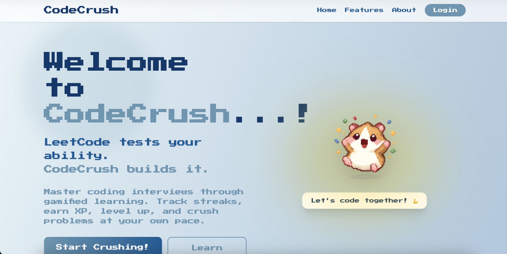
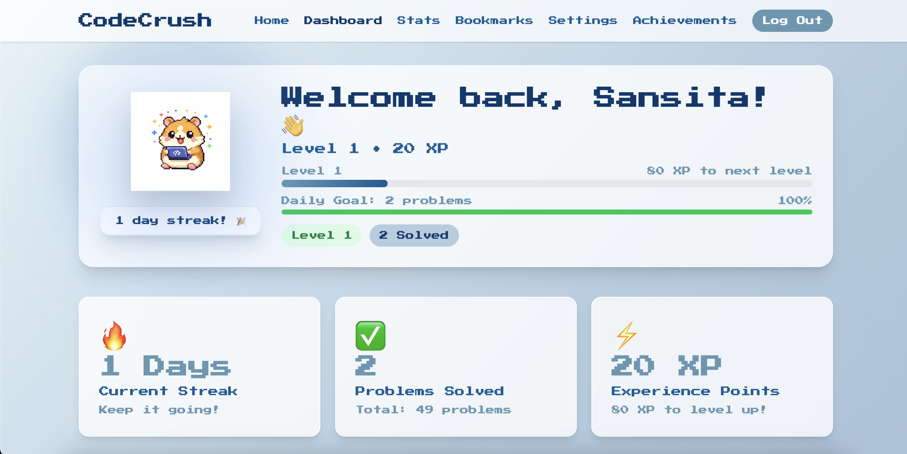
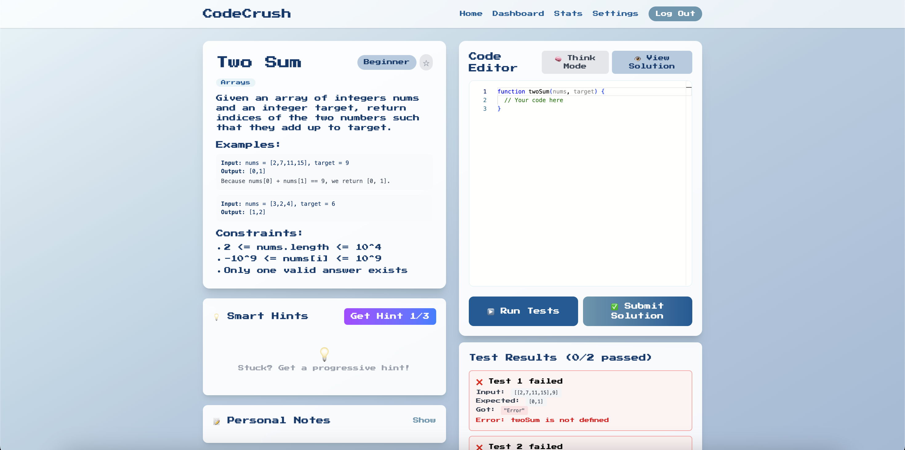
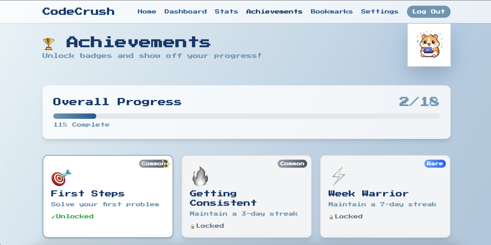
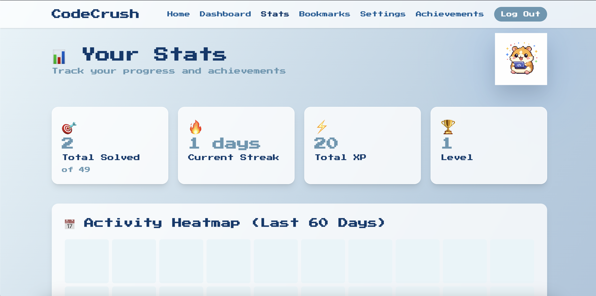

# 🎮 CodeCrush

<div align="center">


### 🌟 *Where LeetCode tests your ability, CodeCrush builds it* 🌟

**A gamified coding interview prep platform built for pre-LeetCode learners who need confidence**

[🚀 Live Demo](https://mycodecrush.vercel.app/) 

</div>

---

## 📸 Screenshots

<div align="center">

### 🏠 Landing Page


### 📊 Dashboard


### 💻 Code Editor


### 🏆 Achievements


### 📊 Stats


</div>

---

## 🎯 Why CodeCrush?

CodeCrush was built for **anxious learners** who feel overwhelmed by traditional coding platforms like LeetCode. Instead of throwing you into the deep end, we help you build confidence through:

- ✅ **Problems matched to YOUR level** - Start from true beginner
- ✅ **Progressive hints that teach** - Not just solve
- ✅ **Gamification that motivates** - Streaks, XP, levels, badges
- ✅ **A supportive learning environment** - Your personal coding companion

---

## ✨ Features

### 🎮 **Gamification System**
- 🔥 **Daily Streaks** - Build consistency with streak tracking
- ⚡ **XP & Leveling** - Earn experience points and level up
- 🏆 **18 Achievements** - Unlock badges as you progress
- 🎯 **Daily Goals** - Set and track your coding targets
- 📊 **Progress Dashboard** - Visualize your growth

### 💡 **Smart Learning Tools**
- 💭 **Progressive Hints** - 3-level hint system guides you without giving away solutions
- 📝 **Personal Notes** - Save your thoughts and approaches for each problem
- ⭐ **Bookmarks** - Star problems to revisit later
- 🧠 **Think Mode** - Hide the editor and plan your approach first
- 👁️ **Solution Viewer** - Access official solutions after solving

### 🐹 **Adorable Mascot**
- 6 emotional states that react to your progress
- Celebrates your wins
- Encourages you when stuck
- Pixel art design throughout

### 📈 **Advanced Analytics**
- 📅 **60-Day Heatmap** - GitHub-style activity visualization
- 📚 **Category Breakdown** - Track progress by topic (Arrays, Strings, etc.)
- 🎚️ **Difficulty Stats** - See how you're progressing across levels
- 📊 **XP Over Time** - Visual charts of your learning journey

### 🔍 **Powerful Filtering**
- Filter by **Difficulty** (True Beginner → Advanced)
- Filter by **Category** (Arrays, Strings, DP, etc.)
- Filter by **Status** (Solved/Unsolved)
- **Search** problems by name

### 💻 **Code Editor Features**
- ✅ **Live Test Execution** - Run test cases instantly
- 🎨 **Syntax Highlighting** - Monaco Editor (VS Code engine)
- 📱 **Responsive Design** - Code anywhere
- ⚡ **Instant Feedback** - See results immediately

### 🎓 **Skill-Based Progression**
- **34+ Problems** across 4 difficulty levels
- **True Beginner** → **Beginner** → **Intermediate** → **Advanced**
- Problems auto-adjust to your skill level
- Complete hints for every problem

---

## 🚀 Tech Stack

### **Frontend**
- ⚛️ **React 18** - Modern UI library
- 🎨 **Tailwind CSS** - Utility-first styling
- ✨ **Framer Motion** - Smooth animations
- 🖥️ **Monaco Editor** - VS Code-powered code editor
- ⚡ **Vite** - Lightning-fast build tool

### **Backend & Database**
- 🔥 **Firebase Authentication** - Secure user auth
- 📊 **Cloud Firestore** - Real-time database
- 🔐 **Protected Routes** - Authentication guards

### **Deployment & Analytics**
- 🚀 **Vercel** - Instant deployments
- 📈 **Vercel Analytics** - Performance tracking

---

## 📦 Installation & Setup

### Prerequisites
- Node.js 18+ 
- npm or yarn
- Firebase account

### 1️⃣ Clone the Repository
```bash
git clone https://github.com/yourusername/codecrush.git
cd codecrush/client
```

### 2️⃣ Install Dependencies
```bash
npm install
```

### 3️⃣ Firebase Configuration

Create a Firebase project at [console.firebase.google.com](https://console.firebase.google.com)

Create `src/firebase/config.js`:
```javascript
import { initializeApp } from 'firebase/app'
import { getAuth } from 'firebase/auth'
import { getFirestore } from 'firebase/firestore'

const firebaseConfig = {
  apiKey: "YOUR_API_KEY",
  authDomain: "YOUR_AUTH_DOMAIN",
  projectId: "YOUR_PROJECT_ID",
  storageBucket: "YOUR_STORAGE_BUCKET",
  messagingSenderId: "YOUR_MESSAGING_SENDER_ID",
  appId: "YOUR_APP_ID"
}

const app = initializeApp(firebaseConfig)
export const auth = getAuth(app)
export const db = getFirestore(app)
```

### 4️⃣ Run Development Server
```bash
npm run dev
```

Open [http://localhost:5173](http://localhost:5173) 🎉

### 5️⃣ Build for Production
```bash
npm run build
npm run preview
```

---

## 📁 Project Structure
```
codecrush/
├── client/
│   ├── public/
│   │   └── mascot/              # Mascot images (6 states)
│   ├── src/
│   │   ├── components/
│   │   │   ├── Mascot.jsx       # Animated mascot component
│   │   │   └── ProtectedRoute.jsx
│   │   ├── contexts/
│   │   │   └── AuthContext.jsx  # Firebase auth wrapper
│   │   ├── data/
│   │   │   └── problems.jsx     # 34 coding problems with hints
│   │   ├── firebase/
│   │   │   └── config.js        # Firebase configuration
│   │   ├── pages/
│   │   │   ├── Home.jsx         # Landing page
│   │   │   ├── Login.jsx        # Login page
│   │   │   ├── Onboarding.jsx   # 4-step signup flow
│   │   │   ├── Dashboard.jsx    # Main dashboard with filters
│   │   │   ├── ProblemSolver.jsx # Code editor + problem view
│   │   │   ├── Stats.jsx        # Analytics & heatmap
│   │   │   ├── Achievements.jsx # Badge collection
│   │   │   ├── Bookmarks.jsx    # Saved problems
│   │   │   └── Settings.jsx     # User preferences
│   │   ├── utils/
│   │   │   ├── codeRunner.js    # Test execution engine
│   │   │   ├── streakUtils.js   # XP & level calculations
│   │   │   └── userPreferences.js
│   │   ├── App.jsx
│   │   └── main.jsx
│   ├── package.json
│   └── vite.config.js
└── README.md
```

---

## 🎨 Color Palette
```css
Primary Blue:    #03396C
Secondary Blue:  #005B96
Accent Blue:     #6497B1
Light Blue:      #B3CDE0
Extra Light:     #E8F4F8
```

---

## 🏆 Achievement System

CodeCrush features **18 unlockable achievements** across 4 rarity tiers:

### 🥈 Common (6)
- 🎯 **First Steps** - Solve your first problem
- 🔥 **Getting Consistent** - 3-day streak
- 💪 **Problem Solver** - Solve 10 problems
- 📚 **Bookworm** - Bookmark 5 problems
- 📝 **Note Taker** - Add notes to 3 problems
- 🐣 **Early Bird** - Join CodeCrush

### 🥇 Rare (7)
- ⚡ **Week Warrior** - 7-day streak
- ⭐ **Rising Star** - Solve 25 problems
- 🏅 **Level 5 Reached** - Reach level 5
- 🚀 **Speed Demon** - Solve 5 in one day
- 📊 **Array Master** - Solve 5 Array problems
- 🔤 **String Guru** - Solve 5 String problems
- 💰 **XP Collector** - Earn 1000 XP

### 💜 Epic (5)
- 👑 **Month Master** - 30-day streak
- 🎖️ **Half Century** - Solve 50 problems
- 💎 **Elite Coder** - Reach level 10
- 🎓 **Beginner Complete** - Solve all Beginner problems
- 🌟 **All-Rounder** - Solve from every category

---

## 📚 Problem Categories

### **Topics Covered:**
- 📊 **Arrays** - Array manipulation, searching, sorting
- 🔤 **Strings** - String operations, pattern matching
- 📚 **Stack** - LIFO data structure problems
- 🔢 **Math** - Mathematical algorithms
- 🔍 **Searching** - Binary search and variants
- 🧮 **Dynamic Programming** - DP fundamentals
- 🔗 **Linked Lists** - Pointer manipulation
- 🌳 **Trees** - Tree traversal and operations
- 🔄 **Bit Manipulation** - Bitwise operations
- 🧩 **Logic** - Problem-solving patterns
- 🎯 **Backtracking** - Recursive exploration
- 🏗️ **Design** - Data structure design

### **Difficulty Levels:**
- 🟢 **True Beginner** (10 problems) - Perfect for absolute beginners
- 🔵 **Beginner** (13 problems) - Basic coding concepts
- 🟡 **Intermediate** (15 problems) - DSA fundamentals
- 🔴 **Advanced** (12 problems) - Interview-level challenges

---

## 🎯 User Flow
```
1. 🏠 Land on beautiful homepage
2. ✍️ Sign up with 4-step onboarding
   └─ Enter name
   └─ Create account
   └─ Select coding level
   └─ Set daily goal
3. 📊 Arrive at personalized dashboard
4. 🎯 Get 3 problems matched to your level
5. 💻 Solve with progressive hints
6. ✅ Submit and earn XP
7. 🔥 Build your streak
8. 🏆 Unlock achievements
9. 📈 Track progress in Stats
10. 🔁 Repeat and level up!
```

---

## 🔥 Key Highlights

### **🎮 Gamification Done Right**
- Dopamine-driven design keeps you coming back
- Visual feedback on every action
- Celebrate wins with animations
- Track progress with satisfying metrics

### **📚 Learning-First Approach**
- Hints teach problem-solving patterns
- Solutions include explanations
- Progress at your own pace
- No pressure, pure learning

### **🎨 Beautiful UX/UI**
- Smooth animations with Framer Motion
- Pixel-perfect design
- Consistent color scheme
- Responsive across devices

### **⚡ Performance Optimized**
- Lightning-fast with Vite
- Optimized bundle size
- Lazy loading where needed
- Smooth 60fps animations

---

## 🛣️ Roadmap

### **Phase 1 ✅ (Completed)**
- [x] Core dashboard
- [x] 34 problems with hints
- [x] XP & leveling system
- [x] Streak tracking
- [x] Code execution

### **Phase 2 ✅ (Completed)**
- [x] Mascot system
- [x] Think Mode
- [x] Personal notes
- [x] Bookmarks
- [x] Solution viewer

### **Phase 3 ✅ (Completed)**
- [x] Stats page with heatmap
- [x] Problem filters
- [x] Achievement system
- [x] Analytics dashboard

### **Phase 4 🚧 (Future)**
- [ ] Social features (leaderboard)
- [ ] Code review with AI
- [ ] Discussion forums
- [ ] Problem submissions
- [ ] Mobile app

---

## 🤝 Contributing

Contributions are welcome! Please follow these steps:

1. **Fork** the repository
2. **Create** a feature branch (`git checkout -b feature/AmazingFeature`)
3. **Commit** your changes (`git commit -m 'Add some AmazingFeature'`)
4. **Push** to the branch (`git push origin feature/AmazingFeature`)
5. **Open** a Pull Request

### Contribution Ideas:
- 🆕 Add more problems with hints
- 🎨 Improve UI/UX
- 🐛 Fix bugs
- 📝 Improve documentation
- ✨ Suggest new features

---

## 📝 License

This project is licensed under the **MIT License** - see the [LICENSE](LICENSE) file for details.

---

## 👨‍💻 Author

**Sansita Malhotra**

- 🌐 Portfolio: [yourportfolio.com](https://yourportfolio.com)
- 💼 LinkedIn: [linkedin.com/in/yourprofile](https://linkedin.com/in/yourprofile)
- 🐙 GitHub: [@yourusername](https://github.com/yourusername)
- 📧 Email: your.email@example.com

---

## 🙏 Acknowledgments

- 🎨 **Design Inspiration** - LeetCode, Duolingo, Habitica
- 🐹 **Mascot Art** - Generated with DALL-E
- 💻 **Code Editor** - Monaco Editor by Microsoft
- 🔥 **Backend** - Firebase by Google
- ✨ **Animations** - Framer Motion

---

## 💖 Support

If you found this project helpful, please consider:

- ⭐ **Starring** the repository
- 🐛 **Reporting** bugs and suggesting features
- 📢 **Sharing** with friends who are learning to code
- 💬 **Leaving** feedback

---

<div align="center">

### 🚀 Built with ❤️ for learners who need confidence

**Made by coders, for coders**

[⬆ Back to Top](#-codecrush)

</div>
